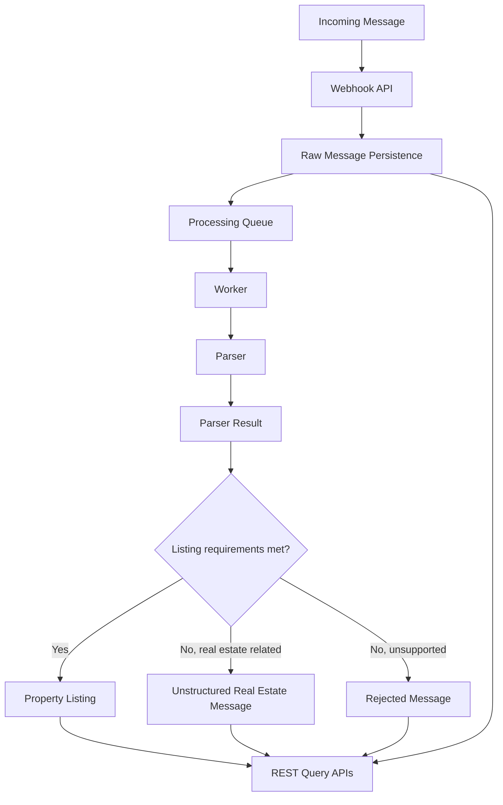
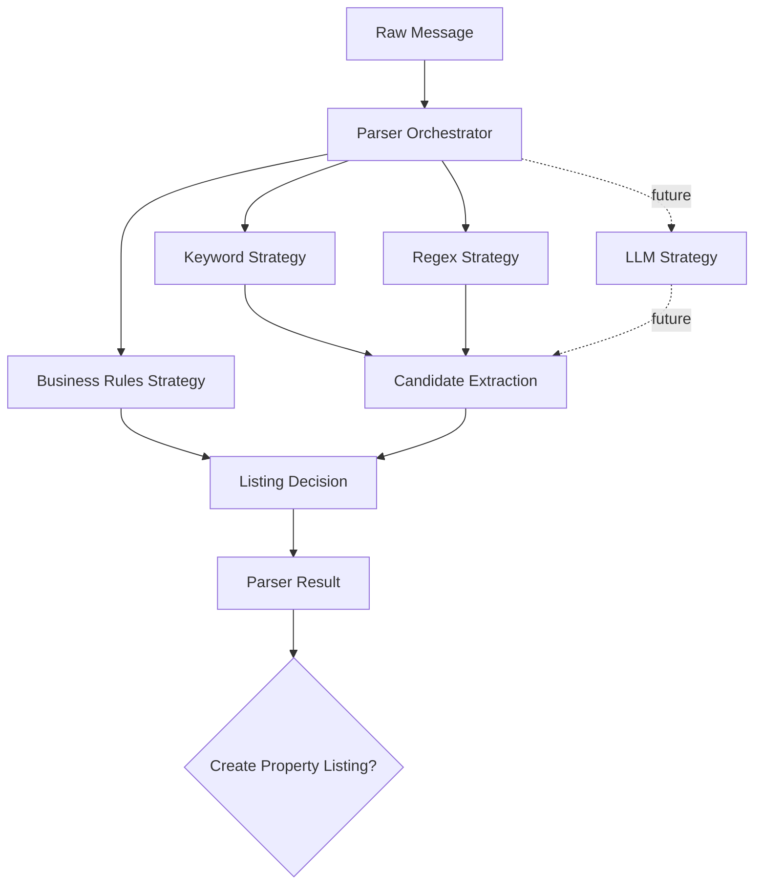

# Garimzap Architecture

## 1. Architectural Goals

Garimzap should be designed as a backend-first, provider-agnostic, modular monolith that validates the complete message processing pipeline before expanding into multiple providers, domains, or AI-assisted features.

This architecture is appropriate for the MVP because the hard problem is not distributed scale yet. The hard problem is preserving clean boundaries while moving a message through ingestion, persistence, asynchronous processing, deterministic parsing, structured data creation, and query APIs. A modular monolith lets the project demonstrate serious engineering discipline without introducing unnecessary service orchestration, network boundaries, deployment complexity, or premature platform abstractions.

The architecture optimizes for:

- Clear business boundaries.
- Testable domain logic.
- Fast local development.
- Provider independence.
- Parser extensibility.
- Reliable asynchronous processing.
- Future SaaS evolution without early SaaS complexity.

The main trade-off is that the MVP keeps everything in one deployable backend application. This is intentional. It reduces operational complexity, but it requires disciplined module boundaries so the codebase does not collapse into a loosely organized application layer. If Garimzap later needs independent scaling, some modules can become separate services after their contracts are proven.

## 2. High-Level Architecture

The system receives a normalized incoming message, stores it immediately, enqueues processing, and returns quickly from the webhook. A worker later consumes the job, runs the parser, stores a parser result, optionally creates a property listing, and exposes the result through REST APIs.

### Incoming Message

The incoming message is the normalized internal representation accepted by the MVP webhook. It is not a WhatsApp, Telegram, Discord, or Slack payload. Future provider adapters should translate external provider payloads into this internal shape before the core pipeline receives them.

### Webhook API

The webhook API validates the incoming message contract, persists the raw message, enqueues processing, and returns a response. It should not classify, parse, enrich, or create property listings.

### Persistence

Persistence is responsible for storing the raw message before any processing happens. This protects the system from losing data if parsing, queueing, or worker processing fails later.

### Queue

The queue decouples message ingestion from parsing. It allows webhook requests to remain fast and gives the worker a controlled processing boundary with retry and failure behavior.

### Worker

The worker consumes processing jobs and coordinates the parsing use case. It should be responsible for orchestration, not business rule ownership.

### Parser

The parser classifies a raw message and extracts structured data using deterministic strategies. It must always produce a parser result, even when a property listing is not created.

### Parser Result

The parser result records the outcome of processing a message. It should indicate whether a listing was created, whether the message was unstructured, or whether it was rejected. It may also include a machine-readable reason for observability and future metrics.

### Property Listing

The property listing is created only when the parser identifies all required MVP fields: real estate intent, property type, location, and explicit price. This keeps the listing dataset intentionally high quality.

### REST API

The REST API exposes raw messages, property listings, and statistics to external consumers. It is the primary consumer interface for the MVP and should be usable by a future dashboard.

## 3. Module Organization

Garimzap should be organized as a modular monolith. Modules should communicate through explicit application services, ports, or public contracts rather than reaching into each other's internals.

### messages

Owns normalized incoming messages and raw message lifecycle.

Responsibilities:

- Validate the internal incoming message model at the application boundary.
- Persist raw messages.
- Track high-level message processing status.
- Expose message query use cases.

The messages module should not know how real estate parsing works.

### processing

Owns asynchronous processing orchestration.

Responsibilities:

- Enqueue raw messages for processing.
- Consume processing jobs.
- Coordinate retries and failure states.
- Call parser application services.
- Ensure processing is idempotent.

The processing module should not contain domain-specific extraction rules.

### parser

Owns parser contracts, parser orchestration, and parser result creation.

Responsibilities:

- Define the parser abstraction.
- Execute parser strategies.
- Normalize parser output into a parser result.
- Explain why a message was accepted, marked unstructured, or rejected.

The parser module should not own persistence details for property listings.

### property-listings

Owns structured real estate listing behavior.

Responsibilities:

- Represent valid property listing concepts.
- Enforce listing creation requirements.
- Expose listing query use cases.
- Support filtering by city, neighborhood, property type, and price range.

The property-listings module is the first concrete business domain module. Future domains should follow the same pattern instead of being added directly to generic parser code.

### statistics

Owns read-oriented processing and extraction metrics.

Responsibilities:

- Report total received messages.
- Report extracted listing count.
- Report extraction success rate.
- Report pending, rejected, and unstructured message counts.

The statistics module should depend on stable read models or query contracts, not on parser implementation details.

### shared

Owns cross-cutting primitives that are genuinely generic.

Responsibilities:

- Shared value objects that are not domain-specific.
- Common error/result types.
- Time and identifier abstractions if needed.
- Configuration contracts.

The shared module should stay small. If business behavior starts accumulating here, it is a sign that module boundaries are weakening.

## 4. Domain Model

The MVP domain model should stay small and explicit.

### Raw Message

A raw message is the original normalized message received by the webhook. It exists before classification and parsing. It is the audit source for the pipeline and should be preserved even when downstream processing fails or rejects the message.

### Processing Job

A processing job represents the asynchronous work required to process a raw message. It connects ingestion to parsing without forcing the webhook to do heavy work. A processing job should be traceable back to exactly one raw message.

### Parser Result

A parser result is the canonical outcome of processing a message. The parser should produce one parser result for every processed raw message.

The expected MVP statuses are:

- `listing_created`
- `unstructured`
- `rejected`

Machine-readable reasons can explain outcomes such as missing price, missing location, unsupported domain, unsupported property type, or insufficient information.

Parser result is important because it gives the system operational memory. Without it, the application might know which listings exist but not why other messages failed to become listings.

### Property Listing

A property listing is a structured real estate opportunity created from a parser result that satisfies the MVP quality rules. It should represent only listings with clear intent, property type, location, and explicit price.

The property listing should reference its originating raw message and parser result conceptually. This preserves traceability from business data back to the original conversation.

## 5. Parser Architecture

The parser should be designed around a stable parser contract and replaceable strategies.

The parser should separate three concerns:

- Detection: deciding whether a message is related to real estate.
- Extraction: identifying fields such as price, property type, location, bedrooms, and contact.
- Decision: deciding whether the extracted data is sufficient to create a property listing.

This separation matters because future strategies should not force changes to existing parser consumers. A new strategy should be added by implementing the parser strategy contract and registering it with the parser orchestration layer. Existing webhook, processing, property listing, and API modules should not need to change.

For the MVP, deterministic strategies are enough:

- Keyword strategy for real estate intent and property type.
- Regex strategy for prices, contacts, bedrooms, and common location patterns.
- Business rules strategy for strict listing creation decisions.

The release candidate keeps one concrete real estate parser implementation and does not introduce a parser registry yet. A registry or plugin-style parser selection should be added only when there are at least two real parser implementations to coordinate.

Future LLM-based extraction should be treated as another strategy, not as a replacement for the parser architecture. AI can enhance extraction or classify ambiguous cases, but the pipeline should still produce the same parser result shape.

## 6. Queue Processing

Asynchronous processing is required because webhook endpoints should be fast, predictable, and resilient. Message ingestion should not be slowed down by parsing complexity, parser failures, retry delays, or future enrichment steps.

### Retry Strategy

Retries should be reserved for transient failures, such as temporary infrastructure errors. Parser decisions such as `missing_price` or `unsupported_domain` are business outcomes, not retryable failures.

The architecture should distinguish:

- Processing failures: unexpected technical failures that may be retried.
- Parser rejections: expected business outcomes that should be recorded as parser results.
- Invalid webhook payloads: boundary validation failures that should not enter the processing pipeline.

### Idempotency Strategy

The system should avoid creating duplicate raw messages, parser results, or property listings when the same external message is received more than once or when a job is retried.

Conceptually, idempotency should be based on the incoming message identity from the provider-agnostic payload plus the source group. A retry should safely converge on the same final state rather than producing duplicate business records.

Idempotency should be enforced at the application and persistence boundary, but exact persistence constraints are intentionally outside the scope of this architecture document.

### Failure Handling

Failures should be visible and diagnosable. A message should never silently disappear after being accepted by the webhook.

The architecture should support:

- Recording pending processing state.
- Recording successful parser outcomes.
- Recording rejected parser outcomes.
- Recording failed processing attempts for technical failures.
- Separating technical failures from expected parser rejections.

This distinction is important for trustworthy statistics. A rejected message is not the same thing as a failed job.

## 7. API Layer

The API layer should expose application use cases without owning business rules.

### Webhook API

Responsibilities:

- Accept provider-agnostic incoming messages.
- Validate the incoming contract.
- Persist raw messages through the messages module.
- Enqueue processing through the processing module.
- Return quickly.

The webhook API should not parse text, create property listings, calculate statistics, or contain provider-specific transformation logic.

### Query APIs

Responsibilities:

- Expose raw messages.
- Expose property listings.
- Support listing filters for city, neighborhood, property type, and price range.
- Return data shaped for future dashboard or external consumers.

Query APIs should not decide whether a message qualifies as a listing. That decision belongs to parser and property listing application logic.

### Statistics API

Responsibilities:

- Expose operational and business metrics.
- Report extraction success rate.
- Report pending, rejected, unstructured, and listing-created counts.

The statistics API should read system outcomes. It should not compute parser decisions or mutate processing state.

## 8. Future Evolution

The MVP architecture should make future expansion possible without pretending those capabilities already exist.

### Provider Adapters

WhatsApp Business API, Meta Cloud API, Evolution API, Z-API, Telegram, Discord, and Slack can be added later as adapter modules that translate provider-specific payloads into Garimzap's normalized incoming message model.

The core pipeline should not change when a new provider is added.

### AI

AI can be introduced as an additional parser or enrichment strategy. It should consume raw messages or parser candidates and produce the same parser result contract used by deterministic strategies.

AI should not become a hidden dependency for core message processing unless the product explicitly chooses that trade-off in a later architecture decision.

### Multi-Domain Parsing

New domains such as agribusiness, raffles, jobs, buying and selling, churches, and communities should be added as separate domain modules with their own parser strategies, validation rules, and structured outputs.

The parser orchestration layer can route messages to domain parsers, but each domain should own its own business rules.

### Dashboard

A future dashboard should consume REST APIs instead of reaching into backend internals. The MVP query and statistics APIs should already provide the shape needed for basic search, filters, and metrics.

### Service Extraction

If future scale requires it, provider adapters, workers, or domain parsers could be extracted into separate services. This should happen only after module contracts prove stable inside the monolith.

## 9. Architecture Decisions

### ADR-001: Provider-Agnostic Webhook

Decision: The MVP accepts Garimzap's normalized incoming message payload instead of integrating with a specific messaging provider.

Why: The MVP goal is to validate the core processing architecture, not provider integration complexity.

Benefits:

- Easier local development.
- Easier testing.
- Better open-source contribution experience.
- Core pipeline remains independent from WhatsApp or other providers.

Drawbacks:

- The MVP does not prove production behavior with a real provider.
- Provider-specific edge cases are deferred.

### ADR-002: Asynchronous Processing

Decision: The webhook persists raw messages and enqueues processing instead of parsing synchronously.

Why: Webhooks should remain fast and reliable even as parsing grows more complex.

Benefits:

- Fast ingestion path.
- Clear retry boundary.
- Better resilience to parser failures.
- Room for future enrichment steps.

Drawbacks:

- Requires queue operational discipline.
- Introduces eventual consistency between message receipt and listing availability.

### ADR-003: Deterministic Parser First

Decision: The MVP parser uses deterministic strategies such as keyword matching, regex, and business rules.

Why: The product philosophy is that AI should enhance Garimzap later, not make version one work.

Benefits:

- Explainable behavior.
- Lower cost.
- Easier automated testing.
- Better fit for an architecture-focused open-source MVP.

Drawbacks:

- Lower flexibility with ambiguous messages.
- More parser rules may be needed for messy real-world text.

### ADR-004: Strict Property Listing Creation

Decision: A property listing is created only when intent, property type, location, and explicit price are detected.

Why: The MVP prioritizes data quality over recall.

Benefits:

- Cleaner listing dataset.
- More trustworthy API results.
- Clear separation between valid listings and unstructured real estate messages.

Drawbacks:

- Some useful opportunities will not become listings.
- Future improvements will be needed for partial listings or confidence scoring.

### ADR-005: REST-First Backend

Decision: The MVP exposes REST APIs as the primary consumer interface and does not implement a frontend dashboard.

Why: The MVP is backend-focused and should validate the processing pipeline before adding UI scope.

Benefits:

- Keeps scope controlled.
- Makes the backend useful to any future frontend.
- Supports testing and demonstration through API clients or scripts.

Drawbacks:

- Less immediate visual storytelling.
- Dashboard-specific UX needs are deferred.

### ADR-006: Modular Monolith

Decision: Garimzap starts as a modular monolith rather than a set of microservices.

Why: The MVP needs clean boundaries, not distributed deployment complexity.

Benefits:

- Faster development.
- Simpler local setup.
- Easier refactoring while contracts evolve.
- Strong enough architecture for a realistic SaaS foundation.

Drawbacks:

- Requires discipline to preserve boundaries.
- Independent scaling is deferred until there is evidence that it is needed.
