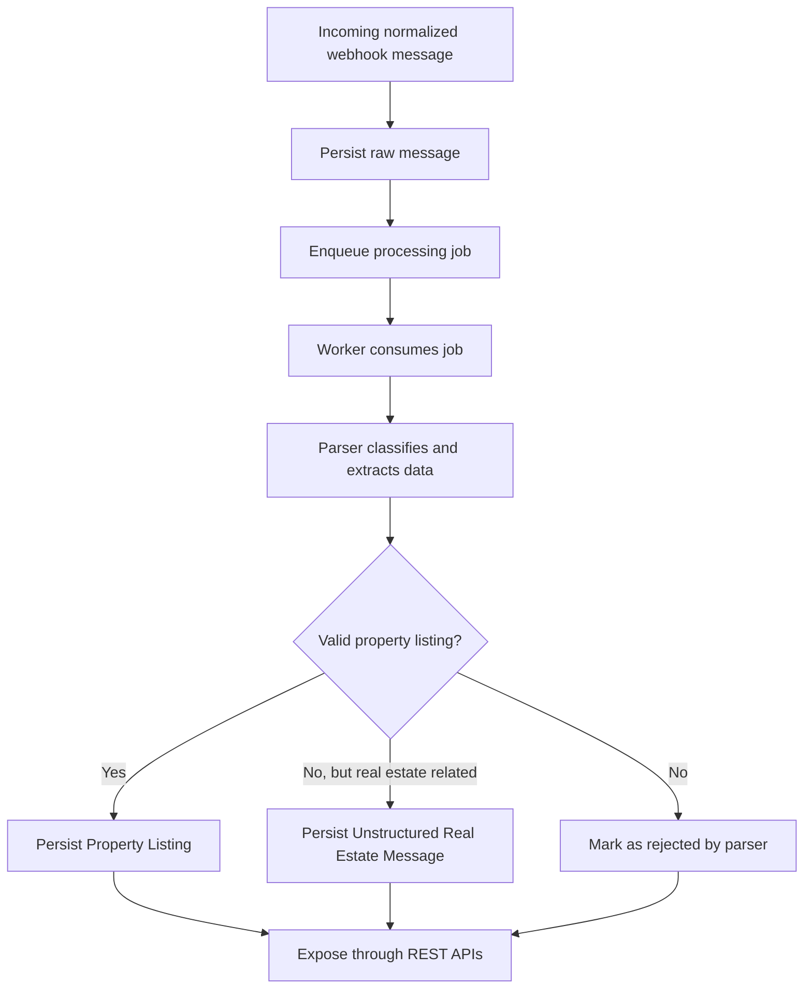

# Garimzap Product Requirements

## 1. Product Summary

Garimzap is a backend platform that transforms high-volume group chat messages into structured business information.

The first version focuses exclusively on real estate listings shared in WhatsApp-style groups. The goal is to validate the message ingestion, asynchronous processing, deterministic parsing, structured persistence, and query API pipeline without depending on AI or any specific messaging provider.

The MVP should prove that useful business data can be extracted from informal chat messages using explicit rules, parsers, and domain logic.

## 2. Business Problem

Valuable business information is often lost inside group conversations. In real estate groups, brokers, agencies, investors, and other professionals spend significant time manually searching old conversations because opportunities quickly disappear inside chat history.

People frequently publish houses, apartments, land, rentals, and sales opportunities using informal free-text messages.

These messages usually contain useful structured data, such as:

- Property type
- Sale or rental intent
- Price
- City
- Neighborhood
- Number of bedrooms
- Contact phone

Today this information is difficult to search, filter, aggregate, or analyze because it remains trapped in chat history.

Garimzap should convert these messages into structured records that can later power search, dashboards, alerts, analytics, and integrations.

## 3. MVP Scope

### In Scope

The MVP must support the following capabilities:

- Receive normalized incoming messages through a provider-agnostic webhook.
- Persist every raw message before processing.
- Process messages asynchronously through a queue and worker.
- Classify real estate messages using deterministic rules.
- Create structured `Property Listing` records only when minimum quality requirements are met.
- Preserve real estate messages that do not meet listing requirements as unstructured parser results.
- Expose REST APIs for raw messages, extracted listings, filters, and basic statistics.
- Keep the core processing pipeline independent from WhatsApp or any external provider.

### Out of Scope

The MVP will not include:

- Authentication or authorization.
- Frontend dashboard implementation.
- Direct WhatsApp, Telegram, Discord, Slack, or other provider integrations.
- AI-based extraction, summarization, semantic search, or auto-replies.
- Multi-domain parsing for agribusiness, raffles, jobs, churches, communities, or general buying and selling.
- Manual review workflows.
- Billing, subscriptions, multi-tenancy, or SaaS administration.

## 4. Target User

The initial target user is a business operator, broker, analyst, or technical founder who participates in real estate groups and wants to transform informal messages into searchable and measurable property data.

For the open-source project, the target audience also includes engineers who want to study a realistic backend architecture using TypeScript, queues, deterministic parsers, and clean module boundaries.

## 5. Primary Use Case

A real estate listing is posted in a group:

```text
VENDO CASA

3 quartos
Jardim Europa
Londrina - PR

R$ 320.000

Contato: (43) 99999-9999
```

Garimzap receives this message through its webhook, stores the raw message, sends it to asynchronous processing, classifies it as a real estate message, extracts structured fields, and persists a `Property Listing` that can be queried by API.

## 6. Incoming Message Contract

The MVP webhook should accept a normalized internal payload rather than a provider-specific payload.

Example shape:

```json
{
  "externalMessageId": "msg_123",
  "groupId": "group_456",
  "groupName": "Imoveis Londrina",
  "senderId": "user_789",
  "senderName": "Maria",
  "text": "VENDO CASA\n3 quartos\nJardim Europa\nLondrina - PR\nR$ 320.000\nContato: (43) 99999-9999",
  "sentAt": "2026-07-01T10:00:00.000Z"
}
```

This keeps development, testing, and contribution simple. Future provider integrations should translate external payloads into this internal message model before entering the processing pipeline.

## 7. Property Listing Creation Rules

The MVP prioritizes data quality over recall.

A `Property Listing` should only be created when the parser can identify all required fields:

- Clear real estate intent, such as sale or rental language.
- Property type, such as house, apartment, land, commercial room, or similar.
- Location, such as city, neighborhood, or equivalent local reference.
- Explicit price.

If a message appears to be related to real estate but does not satisfy the minimum requirements, Garimzap should:

- Store the raw message.
- Mark the parser result as an `Unstructured Real Estate Message`.
- Avoid creating an incomplete `Property Listing`.

This trade-off intentionally favors fewer high-quality records over a large database of incomplete listings.

## 8. Parser Requirements

The first parser implementation should be deterministic and rule-based.

Supported strategies may include:

- Keyword matching for intent and property type.
- Regex extraction for prices, phone numbers, bedrooms, and location patterns.
- Business rules for deciding whether a message is a valid listing or an unstructured real estate message.

The parser should always produce a `Parser Result`, regardless of whether a `Property Listing` is created. This result represents the outcome of processing a message and should make parser behavior observable, debuggable, and measurable.

Example parser result statuses:

- `listing_created`
- `unstructured`
- `rejected`

Parser results may also include machine-readable reasons, such as:

- `missing_price`
- `missing_location`
- `unsupported_domain`
- `unsupported_property_type`
- `insufficient_information`

The MVP should not depend on AI for core functionality.

The parser design should anticipate future parser strategies, such as:

- Additional deterministic parsers.
- Domain-specific parsers for other business categories.
- LLM-assisted extraction.
- Semantic classification.
- Confidence scoring.

These future capabilities should not be implemented in the MVP.

## 9. REST API Requirements

The MVP should expose backend APIs that can later support a dashboard or external consumers.

Primary API resources:

- `/messages`
- `/property-listings`
- `/statistics`

Required API capabilities:

- List received raw messages.
- Retrieve a raw message by ID.
- List extracted property listings.
- Retrieve a property listing by ID.
- Filter listings by:
  - City
  - Neighborhood
  - Property type
  - Minimum price
  - Maximum price
- Retrieve basic processing statistics:
  - Total received messages
  - Total extracted listings
  - Extraction success rate
  - Messages pending processing
  - Messages rejected by parser
  - Unstructured real estate messages

## 10. Processing Pipeline

The intended MVP flow is:



Heavy processing must never happen inside the webhook request cycle. The webhook should validate, persist, enqueue, and return quickly.

## 11. Data Concepts

The PRD intentionally describes concepts rather than database tables. The architecture step will define the final schema.

Core concepts:

- `Raw Message`: Original normalized message received by the webhook.
- `Processing Job`: Asynchronous unit of work responsible for parsing a raw message.
- `Parser Result`: Outcome of attempting to classify and extract information from a raw message. A parser result should always exist after processing and may indicate `listing_created`, `unstructured`, or `rejected`, with an optional machine-readable reason.
- `Property Listing`: Structured real estate opportunity extracted from a valid message.
- `Unstructured Real Estate Message`: Real estate-related message that lacks required fields for a listing.
- `Rejected Message`: Message that does not match the supported domain or cannot be parsed usefully.

## 12. Success Metrics

The MVP is successful if it demonstrates:

- Raw messages can be reliably received and persisted.
- Message processing happens asynchronously.
- Valid real estate listings are extracted with deterministic rules.
- Incomplete real estate messages do not pollute the listing dataset.
- REST APIs expose useful structured data and basic statistics.
- The codebase makes it clear how new domains and provider adapters could be added later.

## 13. Trade-offs

### Provider-Agnostic Webhook First

Garimzap will start with its own normalized webhook payload instead of integrating directly with WhatsApp providers.

This makes the project easier to run, test, document, and contribute to. The cost is that the MVP does not prove a production WhatsApp integration yet.

### Deterministic Parsing Before AI

The MVP will use regex, keywords, and business rules rather than AI.

This keeps the core product explainable, cheap to run, and testable. The cost is lower flexibility for messy or ambiguous messages.

### Strict Listing Creation

The MVP requires intent, property type, location, and price before creating a `Property Listing`.

This protects data quality. The cost is lower recall, because some real opportunities will remain unstructured until future extraction improvements exist.

### Backend APIs Before Dashboard

The MVP exposes APIs but does not implement a frontend dashboard.

This keeps the project focused on the backend pipeline. The cost is that visual product storytelling will rely on README examples, diagrams, mockups, or future frontend work.

## 14. Roadmap

Future versions may include:

- Provider Adapter Layer for:
  - WhatsApp Business API
  - Meta Cloud API
  - Evolution API
  - Z-API
  - Telegram
  - Discord
  - Slack
- Frontend dashboard for search, filters, charts, and operational review.
- Additional domains:
  - Agribusiness commodity prices
  - Raffles
  - Job opportunities
  - Buying and selling
  - Communities
  - Churches
- AI-assisted extraction for ambiguous messages.
- Conversation summarization.
- Semantic search.
- Confidence scores and partial listings.
- Manual review queue.
- Multi-tenant SaaS capabilities.
- Alerts and notifications.

## 15. MVP Planning Decisions

The architecture and roadmap phases resolved the initial planning questions:

- The MVP is a modular monolith with `messages`, `processing`, `parser`, `property-listings`, `statistics`, and `shared` modules.
- The parser is deterministic and currently focused on one real estate parser implementation.
- Parser outcomes are stored as Parser Results and kept separate from the technical Raw Message lifecycle.
- Property Listings are created only when strict required fields are detected.
- PostgreSQL is accessed through Drizzle ORM and node-postgres.
- Redis and BullMQ provide asynchronous processing.
- REST APIs expose raw messages, property listings, filters, and statistics.
- Tests cover ingestion, processing, parser outcomes, listing creation, filters, statistics, and the release demo flow.
