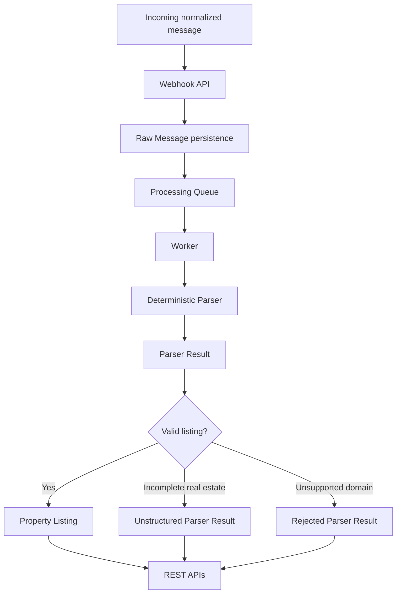

# Garimzap

Garimzap turns high-volume WhatsApp-style group conversations into structured business data.

The MVP focuses on one concrete problem: real estate opportunities disappearing inside group chat history. Brokers, agencies, investors, and operators often spend time scrolling through old messages to find listings, prices, locations, and contacts that were posted informally. Garimzap captures those messages, processes them asynchronously, applies deterministic parsing rules, and exposes searchable Property Listings through REST APIs.

This project is intentionally backend-first. It demonstrates a realistic modular monolith using TypeScript, Fastify, PostgreSQL, Redis, BullMQ, deterministic parsers, and clean module boundaries.

## Why This Exists

Group conversations often contain valuable business events:

```text
VENDO CASA

3 quartos
Jardim Europa
Londrina - PR

R$ 320.000

Contato: (43) 99999-9999
```

Garimzap converts that into structured data:

```json
{
  "propertyType": "house",
  "intent": "sale",
  "priceAmount": 320000,
  "locationText": "Jardim Europa, Londrina - PR",
  "city": "Londrina",
  "neighborhood": "Jardim Europa",
  "state": "PR",
  "bedrooms": 3,
  "contactPhone": "(43) 99999-9999"
}
```

The interesting engineering challenge is not "call an LLM and hope." The challenge is building a reliable ingestion and processing pipeline where AI can be added later without becoming a hidden dependency.

## Product Philosophy

- Deterministic first: regex, keywords, and business rules power the MVP.
- AI later: AI should enhance summarization, semantic search, and ambiguous extraction in future versions.
- Quality over recall: incomplete real estate messages are preserved as parser results but do not become Property Listings.
- Provider agnostic: the MVP accepts a normalized webhook payload instead of depending on WhatsApp, Telegram, Discord, or Slack.
- Backend first: REST APIs are the product surface; a dashboard can consume them later.

## Demo GIF Placeholder

A terminal demo GIF will fit here in a future article or presentation.

```text
Incoming Message
  |
Webhook
  |
Queue
  |
Worker
  |
Parser
  |
Property Listing
  |
REST API
```

## What Works Today

- Provider-agnostic message ingestion.
- Raw message persistence.
- Duplicate-aware ingestion by `externalMessageId` and `groupId`.
- Redis/BullMQ asynchronous processing.
- Separate API and worker processes.
- Deterministic real estate parser.
- Parser Results for every processed message:
  - `listing_created`
  - `unstructured`
  - `rejected`
- Strict Property Listing creation.
- REST APIs for:
  - raw messages
  - property listings
  - statistics
- Local PostgreSQL and Redis through Docker Compose.
- Automated tests, typechecking, linting, formatting, build, and audit scripts.

## Architecture



Garimzap is a modular monolith. The important boundary is not process separation; it is ownership.

| Module              | Responsibility                                                                                 |
| ------------------- | ---------------------------------------------------------------------------------------------- |
| `messages`          | Normalized incoming messages, raw persistence, message query API, technical processing status. |
| `processing`        | Queue integration, worker orchestration, retry boundary, processing lifecycle.                 |
| `parser`            | Deterministic real estate detection, extraction, decision, and Parser Result persistence.      |
| `property-listings` | Structured real estate listing persistence and query APIs.                                     |
| `statistics`        | Read-only product and processing metrics from persisted outcomes.                              |
| `shared`            | Configuration and database infrastructure.                                                     |
| `drizzle`           | SQL migrations.                                                                                |

## Requirements

- Node.js 22 or newer.
- npm.
- Docker, for local PostgreSQL and Redis.

## Local Setup

Install dependencies:

```bash
npm install
```

Create a local environment file:

```bash
cp .env.example .env
```

Start PostgreSQL and Redis:

```bash
docker compose up -d
```

If your Docker installation uses the legacy Compose command:

```bash
docker-compose up -d
```

Run database migrations:

```bash
npm run db:migrate
```

Start the API in one terminal:

```bash
npm run dev
```

Start the worker in another terminal:

```bash
npm run dev:worker
```

Check service health:

```bash
curl http://localhost:3000/health
```

Expected response:

```json
{
  "environment": "development",
  "status": "ok"
}
```

## Five-Minute Demo

The canonical demo flow lives in [docs/demo.md](./docs/demo.md).

Short version:

1. Send a normalized incoming message to `POST /webhooks/messages`.
2. Let the worker process the queued message.
3. Query `GET /property-listings`.
4. Query `GET /statistics`.

## API Examples

### Submit A Message

```bash
curl -X POST http://localhost:3000/webhooks/messages \
  -H "Content-Type: application/json" \
  -d '{
    "externalMessageId": "demo_msg_001",
    "groupId": "demo_group_001",
    "groupName": "Imoveis Londrina",
    "senderId": "demo_user_001",
    "senderName": "Maria",
    "text": "VENDO CASA\n3 quartos\nJardim Europa\nLondrina - PR\nR$ 320.000\nContato: (43) 99999-9999",
    "sentAt": "2026-07-01T10:00:00.000Z"
  }'
```

Successful ingestion returns `201 Created`. Sending the same `externalMessageId` and `groupId` again returns the existing raw message with `created: false`.

### List Raw Messages

```bash
curl http://localhost:3000/messages
```

### List Property Listings

```bash
curl http://localhost:3000/property-listings
```

### Filter Property Listings

```bash
curl "http://localhost:3000/property-listings?city=Londrina&propertyType=house&minPrice=300000&maxPrice=500000"
```

Example response:

```json
{
  "data": [
    {
      "id": "generated-listing-id",
      "rawMessageId": "generated-message-id",
      "parserResultId": "generated-parser-result-id",
      "intent": "sale",
      "propertyType": "house",
      "priceAmount": 320000,
      "locationText": "Jardim Europa, Londrina - PR",
      "city": "Londrina",
      "neighborhood": "Jardim Europa",
      "state": "PR",
      "bedrooms": 3,
      "contactPhone": "(43) 99999-9999",
      "createdAt": "generated-created-timestamp"
    }
  ]
}
```

### Retrieve One Property Listing

```bash
curl http://localhost:3000/property-listings/generated-listing-id
```

If the listing does not exist, the API returns `404 Not Found`.

### Get Statistics

```bash
curl http://localhost:3000/statistics
```

Example response:

```json
{
  "data": {
    "totalReceivedMessages": 10,
    "totalPropertyListings": 4,
    "extractionSuccessRate": 40,
    "totalUnstructuredMessages": 3,
    "totalRejectedMessages": 2,
    "totalMessagesCurrentlyProcessing": 1
  }
}
```

`extractionSuccessRate` is calculated as:

```text
listing_created parser results / processed raw messages * 100
```

## Development Workflow

Run the release-quality checks locally:

```bash
npm run db:migrate
npm test
npm run typecheck
npm run lint
npm run format:check
npm run build
npm audit --audit-level=high
```

Useful scripts:

| Script                 | Purpose                                |
| ---------------------- | -------------------------------------- |
| `npm run dev`          | Start the API with watch mode.         |
| `npm run dev:worker`   | Start the worker with watch mode.      |
| `npm run db:migrate`   | Apply SQL migrations from `drizzle/`.  |
| `npm test`             | Run Vitest.                            |
| `npm run typecheck`    | Run TypeScript without emitting files. |
| `npm run lint`         | Run ESLint.                            |
| `npm run format:check` | Check Prettier formatting.             |
| `npm run build`        | Compile TypeScript.                    |

## Current Limitations

This is an MVP release candidate, not a complete SaaS product.

- Real estate is the only supported domain.
- Parser vocabulary is intentionally small and Portuguese-focused.
- Parsing is deterministic; no AI is used.
- No authentication or authorization.
- No provider adapters for WhatsApp, Telegram, Discord, or Slack.
- No frontend dashboard.
- No pagination, sorting, full-text search, semantic search, saved filters, or alerts.
- No multi-tenancy or billing.
- No production deployment automation.
- No database indexes beyond the constraints required for MVP correctness.

## Roadmap

Future work should stay clearly separated from the implemented MVP:

- Provider Adapter Layer for WhatsApp Business API, Meta Cloud API, Evolution API, Z-API, Telegram, Discord, and Slack.
- Dashboard for search, filters, charts, and operational review.
- Additional business domains such as agribusiness, raffles, jobs, buying and selling, communities, and churches.
- AI-assisted extraction for ambiguous messages.
- Conversation summarization.
- Semantic search.
- Confidence scores and partial listing workflows.
- Manual review queue.
- Authentication, multi-tenancy, billing, and SaaS administration.
- Deployment documentation and production operations hardening.

## Project Documents

- [Product Requirements](./PRODUCT_REQUIREMENTS.md)
- [Architecture](./ARCHITECTURE.md)
- [Development Roadmap](./DEVELOPMENT_ROADMAP.md)
- [Demo Guide](./docs/demo.md)
- [Contributing](./CONTRIBUTING.md)

## License

MIT. See [LICENSE](./LICENSE).
