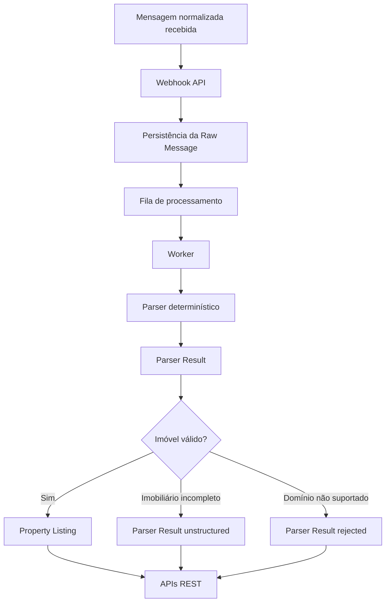

# Entrelinhas

Entrelinhas transforma conversas de grupos no estilo WhatsApp em dados de negócio estruturados.

O MVP foca em um problema concreto: oportunidades imobiliárias que desaparecem no histórico de grupos. Corretores, imobiliárias, investidores e operadores gastam tempo procurando mensagens antigas para encontrar imóveis, preços, bairros, cidades e contatos publicados de forma informal.

Entrelinhas captura essas mensagens, processa tudo de forma assíncrona, aplica regras determinísticas de parsing e expõe os imóveis extraídos por meio de APIs REST.

Este projeto é intencionalmente backend-first. Ele demonstra uma arquitetura realista de monólito modular com TypeScript, Fastify, PostgreSQL, Redis, BullMQ, parsers determinísticos e fronteiras claras entre módulos.

## Por Que Este Projeto Existe

Grupos de conversa costumam conter eventos de negócio valiosos:

```text
VENDO CASA

3 quartos
Jardim Europa
Londrina - PR

R$ 320.000

Contato: (43) 99999-9999
```

Entrelinhas converte isso em dado estruturado:

```json
{
  "propertyType": "house",
  "intent": "sale",
  "priceAmount": 320000,
  "locationText": "Jardim Europa, Londrina - PR",
  "city": "Londrina",
  "neighborhood": "Jardim Europa",
  "state": "PR",
  "bedrooms": 3,
  "contactPhone": "(43) 99999-9999"
}
```

O desafio interessante aqui não é "chamar uma LLM e torcer". O desafio é construir um pipeline confiável de ingestão e processamento, onde IA pode ser adicionada depois como melhoria, não como dependência invisível.

## Filosofia Do Produto

- Determinístico primeiro: regex, palavras-chave e regras de negócio sustentam o MVP.
- IA depois: IA deve melhorar sumarização, busca semântica e extrações ambíguas em versões futuras.
- Qualidade acima de volume: mensagens imobiliárias incompletas são preservadas como resultados do parser, mas não viram imóveis estruturados.
- Independente de provedor: o MVP recebe um payload normalizado em vez de depender diretamente de WhatsApp, Telegram, Discord ou Slack.
- Backend primeiro: APIs REST são a superfície principal do produto; um dashboard pode consumi-las no futuro.

## Espaço Para GIF De Demonstração

Uma demonstração em GIF no terminal pode entrar aqui em um artigo ou apresentação futura.

```text
Mensagem recebida
  |
Webhook
  |
Fila
  |
Worker
  |
Parser
  |
Imóvel estruturado
  |
API REST
```

## O Que Funciona Hoje

- Ingestão de mensagens independente de provedor.
- Persistência de mensagens brutas.
- Ingestão idempotente por `externalMessageId` e `groupId`.
- Processamento assíncrono com Redis e BullMQ.
- Processos separados para API e worker.
- Parser imobiliário determinístico.
- Parser Results para toda mensagem processada:
  - `listing_created`
  - `unstructured`
  - `rejected`
- Criação rigorosa de Property Listings.
- APIs REST para:
  - mensagens brutas
  - imóveis estruturados
  - estatísticas
- PostgreSQL e Redis locais via Docker Compose.
- Testes automatizados, typecheck, lint, formatação, build e audit.

## Arquitetura



Entrelinhas é um monólito modular. A fronteira mais importante não é a separação em processos; é a separação de responsabilidades.

| Módulo              | Responsabilidade                                                                               |
| ------------------- | ---------------------------------------------------------------------------------------------- |
| `messages`          | Mensagens normalizadas, persistência bruta, API de consulta e status técnico de processamento. |
| `processing`        | Integração com fila, orquestração do worker, retries e ciclo técnico de processamento.         |
| `parser`            | Detecção, extração, decisão e persistência de Parser Results para o domínio imobiliário.       |
| `property-listings` | Persistência e APIs de consulta para imóveis estruturados.                                     |
| `statistics`        | Métricas de produto e processamento calculadas a partir dos dados persistidos.                 |
| `shared`            | Configuração e infraestrutura de banco de dados.                                               |
| `drizzle`           | Migrações SQL.                                                                                 |

## Requisitos

- Node.js 22 ou superior.
- npm.
- Docker, para PostgreSQL e Redis locais.

## Como Rodar Localmente

Instale as dependências:

```bash
npm install
```

Crie o arquivo de ambiente local:

```bash
cp .env.example .env
```

Suba PostgreSQL e Redis:

```bash
docker compose up -d
```

Se sua instalação do Docker usa o comando Compose legado:

```bash
docker-compose up -d
```

Execute as migrações:

```bash
npm run db:migrate
```

Inicie a API em um terminal:

```bash
npm run dev
```

Inicie o worker em outro terminal:

```bash
npm run dev:worker
```

Verifique a saúde do serviço:

```bash
curl http://localhost:3000/health
```

Resposta esperada:

```json
{
  "environment": "development",
  "status": "ok"
}
```

## Demonstração Em Cinco Minutos

O fluxo canônico de demonstração está em [docs/demo.md](./docs/demo.md).

Versão curta:

1. Envie uma mensagem normalizada para `POST /webhooks/messages`.
2. Deixe o worker processar a mensagem na fila.
3. Consulte `GET /property-listings`.
4. Consulte `GET /statistics`.

## Exemplos De API

### Enviar Uma Mensagem

```bash
curl -X POST http://localhost:3000/webhooks/messages \
  -H "Content-Type: application/json" \
  -d '{
    "externalMessageId": "demo_msg_001",
    "groupId": "demo_group_001",
    "groupName": "Imoveis Londrina",
    "senderId": "demo_user_001",
    "senderName": "Maria",
    "text": "VENDO CASA\n3 quartos\nJardim Europa\nLondrina - PR\nR$ 320.000\nContato: (43) 99999-9999",
    "sentAt": "2026-07-01T10:00:00.000Z"
  }'
```

Uma ingestão bem-sucedida retorna `201 Created`. Enviar novamente o mesmo `externalMessageId` com o mesmo `groupId` retorna a mensagem bruta existente com `created: false`.

### Listar Mensagens Brutas

```bash
curl http://localhost:3000/messages
```

### Listar Imóveis Estruturados

```bash
curl http://localhost:3000/property-listings
```

### Filtrar Imóveis

```bash
curl "http://localhost:3000/property-listings?city=Londrina&propertyType=house&minPrice=300000&maxPrice=500000"
```

Exemplo de resposta:

```json
{
  "data": [
    {
      "id": "generated-listing-id",
      "rawMessageId": "generated-message-id",
      "parserResultId": "generated-parser-result-id",
      "intent": "sale",
      "propertyType": "house",
      "priceAmount": 320000,
      "locationText": "Jardim Europa, Londrina - PR",
      "city": "Londrina",
      "neighborhood": "Jardim Europa",
      "state": "PR",
      "bedrooms": 3,
      "contactPhone": "(43) 99999-9999",
      "createdAt": "generated-created-timestamp"
    }
  ]
}
```

### Buscar Um Imóvel Por ID

```bash
curl http://localhost:3000/property-listings/generated-listing-id
```

Se o imóvel não existir, a API retorna `404 Not Found`.

### Consultar Estatísticas

```bash
curl http://localhost:3000/statistics
```

Exemplo de resposta:

```json
{
  "data": {
    "totalReceivedMessages": 10,
    "totalPropertyListings": 4,
    "extractionSuccessRate": 40,
    "totalUnstructuredMessages": 3,
    "totalRejectedMessages": 2,
    "totalMessagesCurrentlyProcessing": 1
  }
}
```

`extractionSuccessRate` é calculado assim:

```text
parser results listing_created / raw messages processed * 100
```

## Fluxo De Desenvolvimento

Execute as validações de release localmente:

```bash
npm run db:migrate
npm test
npm run typecheck
npm run lint
npm run format:check
npm run build
npm audit --audit-level=high
```

Scripts úteis:

| Script                 | Finalidade                                |
| ---------------------- | ----------------------------------------- |
| `npm run dev`          | Inicia a API em modo watch.               |
| `npm run dev:worker`   | Inicia o worker em modo watch.            |
| `npm run db:migrate`   | Aplica as migrações SQL de `drizzle/`.    |
| `npm test`             | Executa o Vitest.                         |
| `npm run typecheck`    | Executa o TypeScript sem emitir arquivos. |
| `npm run lint`         | Executa o ESLint.                         |
| `npm run format:check` | Verifica formatação com Prettier.         |
| `npm run build`        | Compila o TypeScript.                     |

## Limitações Atuais

Este é um MVP pronto para demonstração, não um SaaS completo.

- Hoje, o projeto cobre apenas o domínio imobiliário.
- O vocabulário do parser ainda é pequeno e focado em mensagens em português do Brasil.
- O parser é determinístico: não usa IA.
- Ainda não há autenticação ou autorização.
- Ainda não existem adaptadores para WhatsApp, Telegram, Discord ou Slack.
- Ainda não há dashboard web.
- Ainda não há paginação, ordenação, busca textual, busca semântica, filtros salvos ou alertas.
- Ainda não há suporte a multi-tenancy ou cobrança.
- Ainda não há automação de deploy para produção.
- O banco ainda não possui índices pensados para performance em escala; há apenas as restrições necessárias para a corretude do MVP.

## Roadmap

Trabalhos futuros devem permanecer claramente separados do MVP já implementado:

- Camada de Provider Adapters para WhatsApp Business API, Meta Cloud API, Evolution API, Z-API, Telegram, Discord e Slack.
- Dashboard para busca, filtros, gráficos e revisão operacional.
- Novos domínios de negócio, como agronegócio, rifas, vagas, compra e venda, comunidades e igrejas.
- Extração assistida por IA para mensagens ambíguas.
- Sumarização de conversas.
- Busca semântica.
- Scores de confiança e fluxos de listagens parciais.
- Fila de revisão manual.
- Autenticação, multi-tenancy, cobrança e administração SaaS.
- Documentação de deploy e endurecimento operacional para produção.

## Documentos Do Projeto

- [Product Requirements](./PRODUCT_REQUIREMENTS.md)
- [Architecture](./ARCHITECTURE.md)
- [Development Roadmap](./DEVELOPMENT_ROADMAP.md)
- [Demo Guide](./docs/demo.md)
- [Contributing](./CONTRIBUTING.md)

## Licença

MIT. Veja [LICENSE](./LICENSE).
